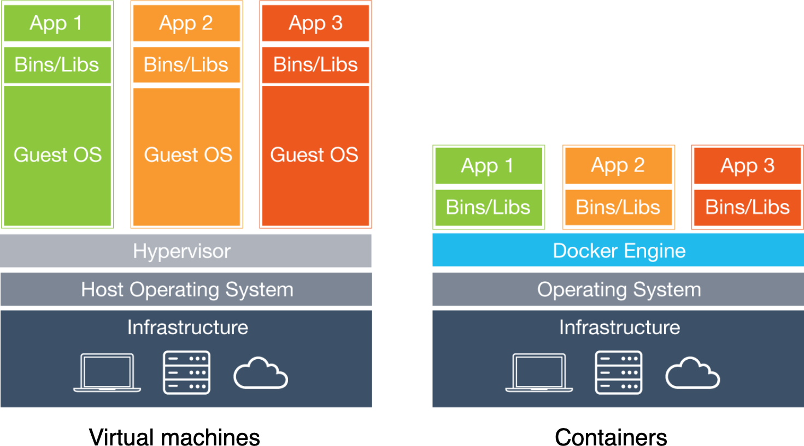
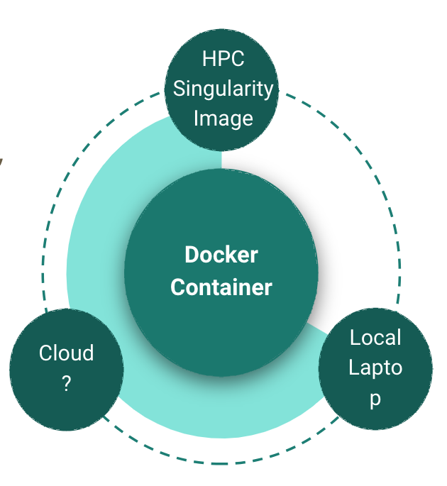

# Introduction to Using Containers on OSCAR

**CCV BootCamp 2026**
**Ashok Ragavendran**

## Resources for Help

Center for Computation and Visualization

- Office hours
- Website: <https://ccv.brown.edu>
- Documentation: <https://docs.ccv.brown.edu>
- Slack: `ccv-share` workspace
- Email: support@ccv.brown.edu

## Why Containers

A really simple and lightweight approach to ensure that both code and environment are portable.

### Use Cases

*Source: <https://apptainer.org/docs/user/latest/introduction.html#why-use-containers>*

#### BYOE: Bring Your Own Environment

Engineering workflows for research computing can be a complicated and iterative process, and even more so on a shared and somewhat inflexible production environment. Apptainer solves this problem by making the environment flexible.

Additionally, it is common (especially in education) for schools to provide a standardized, pre-configured Linux distribution to students that includes all of the necessary tools, programs, and configurations so they can immediately follow along.

#### Reproducible Science

Apptainer containers can be built to include all of the programs, libraries, data, and scripts such that an entire demonstration can be contained and either archived or distributed for others to replicate, no matter what version of Linux they are presently running.

#### Commercially Supported Code Requiring a Particular Environment

Some commercial applications are only certified to run on particular versions of Linux. If that application were installed into an Apptainer container running the version of Linux that it is certified for, that container could run on any Linux host. The application environment, libraries, and certified stack would all continue to run exactly as intended.

Additionally, Apptainer blurs the line between container and host, such that your home directory (and other directories) exist within the container. Applications within the container have full and direct access to all files you own, so you can easily incorporate the contained commercial application into your work and process flow on the host.

#### Static Environments (Software Appliances)

A "fund once, update never" software development model. While this is not ideal, it is a common scenario for research funding. A certain amount of money is granted for initial development, and once that has been done the interns, grad students, post-docs, or developers are reassigned to other projects. This leaves the software stack unmaintained, and even rebuilds for updated compilers or Linux distributions cannot be done without unfunded effort.

#### Legacy Code on Old Operating Systems

Similar to the above example, while this is less than ideal, it is a fact of the research ecosystem. As an example, I know of one Linux distribution that has been end-of-life for 15 years and is still in production due to the software stack custom-built for this environment. Apptainer has no problem running that operating system and application stack on a current operating system and hardware.

#### Complicated Software Stacks That Are Very Host-Specific

There are various software packages that are so complicated that it takes much effort to port, update, and qualify them for new operating systems or compilers. Atmospheric and weather applications are a good example of this. Porting them to a contained operating system will prolong the usefulness of the development effort considerably.

#### Complicated Workflows That Require Custom Installation and/or Data

Consolidating a workflow into an Apptainer container simplifies distribution and replication of scientific results. Making containers available along with published work enables other scientists to build upon (and verify) previous scientific work.

## So What Exactly Are Containers?

Docker containers are like virtual machines, except that they share the host's OS kernel, which makes them very lightweight. However, it's still useful to think of Docker containers as virtual machines, because they feel like their own self-contained units.

*Source: <https://erick.matsen.org/2018/04/19/docker.html>*

In fact, focusing on what is abstracted away by virtual machines and containers can help make containers conceptually "click" for you. In short:

- Virtual machines and hypervisors abstract away hardware and enable you to run operating systems.
- Containers (technically container engines) abstract away operating systems and enable you to run applications.

*Source: <https://www.cbtnuggets.com/blog/certifications/cloud/container-v-hypervisor-whats-the-difference>*



The practical difference: a virtual machine carries an entire guest operating system (often gigabytes and a slow boot), while a container packages only your application and its dependencies on top of the host kernel. Containers therefore start in seconds, are small enough to share easily, and run nearly at native speed — which is exactly why they are a good fit for reproducible research on shared HPC systems like OSCAR.

## Some Popular or Relevant Container Platforms

- **Docker** — <https://www.docker.com/products/docker-desktop/> — the most widely used engine for building and running containers; great on your own laptop or workstation, but it generally requires root/daemon privileges, which makes it unsuitable for shared HPC clusters.
- **Apptainer** (formerly Singularity) — <https://apptainer.org/docs/user/latest/introduction.html#why-use-apptainer> — designed for HPC. It runs as your own user (no root daemon), respects the cluster's permissions, and is what we use on OSCAR.

Because both follow the **Open Container Initiative (OCI)** image standard, an image built with Docker can be converted to and run with Apptainer. That is the foundation of the laptop-to-cluster workflow described later.

### Container Runtime

A container runtime is the foundational software that allows containers to operate within a host system. The container runtime is responsible for everything from pulling container images from a container registry and managing their life cycle to running the containers on your system.

#### Container Runtimes vs. Container Engines

While a container runtime is responsible for running containers, a container engine is a broader system that manages even more of the life cycle of containers, including image distribution, container orchestration, and runtime management.

One common misconception is that Docker and container runtimes are the same. While Docker Engine includes a container runtime, it also offers a suite of tools for building, shipping, and running containerized applications, making it much more than just a runtime.

*Source: <https://www.wiz.io/academy/container-runtimes>*

## A Quick Dive into Containers

Before we start, make sure you have:

- [ ] Docker Desktop installed (for the local portion) — <https://www.docker.com/products/docker-desktop/>
- [ ] An OSCAR account — request one at <https://docs.ccv.brown.edu/oscar/account-types>
- [ ] Open OnDemand open in a browser — <https://ood.ccv.brown.edu>

We will use Docker locally and Apptainer on OSCAR. This is mainly possible due to the Open Container Initiative: <https://opencontainers.org/>

A few things that are specific to OSCAR and worth knowing up front:

- **Apptainer is already installed** on the compute nodes (batch, GPU, and VNC partitions) and is on your `$PATH`. You do **not** need to `module load` anything to use the `apptainer` command.
- **Compute nodes have no internet access.** You therefore *pull or build* your images on a login node (or build them on your laptop and copy them over), then *run* them in a job. You cannot pull an image from inside a batch job.
- **Images are large.** Store them in your `data` or `scratch` space rather than `home` (which is capped at ~100 GB), and point Apptainer's cache there too (see "Running Containers on OSCAR").

## Some Terminology and Concepts

### Containers vs. Images

Images are a blueprint, and containers are the product of that blueprint. If a Docker image is a map of a house, then a Docker container is an actually built house — in other words, an instance of an image. As per the official website, a container is a runnable instance of an image.

- Images are immutable.
- Once a container is running you can modify it, but modifications are lost after the container stops.

*Source: <https://www.geeksforgeeks.org/difference-between-docker-image-and-container/>*

### Registries

A registry is a server that stores and distributes images. **Docker Hub** (<https://hub.docker.com>) is the most common public registry; others include Quay, the GitHub Container Registry, and NVIDIA NGC. You `pull` an image from a registry to get a local copy, and `push` an image to share it. On OSCAR you typically pull from a registry on a login node and then convert the image to Apptainer's format.

### Recipes: Dockerfile and Definition File

You do not have to build images by hand. A **Dockerfile** (for Docker) and an **Apptainer definition file** (`.def`, for Apptainer) are text recipes that describe, step by step, how to build an image — the base OS, the packages to install, files to copy in, and the default command to run. Keeping this recipe in version control (e.g., GitHub) is what makes a build reproducible: anyone can rebuild the same environment from the recipe.

### Mount Points (Binds)

These are locations on the host that are mounted into your running container. If your laptop were a container, a mount point would be a USB stick. Container platforms differ on how they want you to specify mount points and what gets mounted.

- Docker requires you to explicitly mount each location that you want to access from within the container (`-v` / `--mount`).
- Apptainer seamlessly mounts your home directory (and other default paths) automatically, and runs as you, so files you create inside the container are owned by you on the host.

### Ports and Such

Docker containers can be run as a service, meaning you might not directly interact with the container or the executables inside. Rather, you use the container to provide access to an application over the network, such as a web server or a database server. Some examples are Jupyter notebooks, RStudio, etc. In this case, you may need to specify how the networks are translated between the host and the container (port mapping). The advantage is that you can run multiple containers from the same image across different ports.

## So How Can We Leverage This?



The idea is to be able to seamlessly port your entire environment across multiple platforms. In the example above, one way is to use a Docker container to run an application, and then, when you need more computational resources, move to an HPC cluster (here, OSCAR) or the cloud. Moving to a cluster is where you would transform your Docker container into an Apptainer image, and this is what we do for the most part here at CCV.

There are a few different methods to port a container:

- **Build and push to a registry, then pull from there.** Build on your laptop, `push` to Docker Hub (or another registry), and on an OSCAR login node run `apptainer build myimage.sif docker://youruser/yourimage:tag`. Best when the image can be public or you have a private registry.
- **Build and copy the file over.** Build locally, save the image to a single file, copy that file to OSCAR (e.g., with `scp`, `rsync`, or Globus), and build/run from it. Best when the image must stay private or the registry route is inconvenient.

### Basic Commands That Are Useful

| Task | Docker | Apptainer |
| --- | --- | --- |
| Download an image | `docker pull` | `apptainer pull` |
| Build an image from a recipe | `docker build` | `apptainer build` |
| Run the image's default command | `docker run` | `apptainer run` |
| Run a specific command in it | `docker exec` | `apptainer exec` |
| Open an interactive shell | `docker run -it ... bash` | `apptainer shell` |
| List local images | `docker images` | *(images are just `.sif` files)* |
| List running containers | `docker ps` | *(no daemon; use normal process tools)* |

A key conceptual difference: Docker runs a background **daemon** and manages containers for you (hence `docker ps`), while Apptainer has **no daemon** — an Apptainer image is just a single `.sif` file you execute directly, and it runs as an ordinary process under your user account.

Let's run a few test commands so you have an idea of what these do. We will use the `lolcow` container as an example — a tiny image whose only job is to print an ASCII cow saying a random fortune, so it is easy to tell when it worked.

**With Docker (on your laptop):**

```bash
# Pull the image
docker pull godlovedc/lolcow

# Run its default command (you should see a cow saying a fortune)
docker run godlovedc/lolcow

# Or start it in the background and exec a specific command inside it
docker run -dit --name lolcow godlovedc/lolcow
docker ps
docker exec -it lolcow cowsay moo
```

**With Apptainer (on an OSCAR login node):**

```bash
# Pull and convert to a .sif file (creates lolcow_latest.sif)
apptainer pull docker://sylabsio/lolcow

# Run its default command
apptainer run lolcow_latest.sif

# Exec a specific command inside it
apptainer exec lolcow_latest.sif cowsay moo

# Drop into an interactive shell inside the container
apptainer shell lolcow_latest.sif
```

## Building Your Own Image

Pulling existing images is great, but the real power for reproducibility comes from building your own from a recipe you can version-control.

**A minimal Dockerfile** (build on your laptop):

```dockerfile
FROM python:3.12-slim

# Install OS-level dependencies
RUN apt-get update && apt-get install -y --no-install-recommends \
    git && \
    rm -rf /var/lib/apt/lists/*

# Install Python dependencies (pin versions for reproducibility)
COPY requirements.txt /tmp/requirements.txt
RUN pip install --no-cache-dir -r /tmp/requirements.txt

# Copy in your analysis code
COPY ./src /opt/src
WORKDIR /opt/src

# Default command
CMD ["python", "main.py"]
```

```bash
docker build -t myanalysis:1.0 .
docker run myanalysis:1.0
```

**The equivalent Apptainer definition file** (`myanalysis.def`):

```text
Bootstrap: docker
From: python:3.12-slim

%files
    requirements.txt /tmp/requirements.txt
    src /opt/src

%post
    apt-get update && apt-get install -y --no-install-recommends git
    rm -rf /var/lib/apt/lists/*
    pip install --no-cache-dir -r /tmp/requirements.txt

%runscript
    cd /opt/src && exec python main.py
```

```bash
apptainer build myanalysis.sif myanalysis.def
apptainer run myanalysis.sif
```

> **Tip:** building an Apptainer image from a `.def` file may require elevated privileges (`--fakeroot`). It is often easiest to build with Docker on your own machine and convert (next section).

### Converting a Docker Image to Apptainer

On an OSCAR login node, build a `.sif` directly from a registry:

```bash
apptainer build myanalysis.sif docker://youruser/myanalysis:1.0
```

If the image is private or local-only, save it to a file on your laptop and transfer it:

```bash
# On your laptop
docker save myanalysis:1.0 -o myanalysis.tar
scp myanalysis.tar you@ssh.ccv.brown.edu:/oscar/scratch/$USER/

# On an OSCAR login node
apptainer build myanalysis.sif docker-archive://myanalysis.tar
```

## Running Containers on OSCAR

### Set the cache and image location

Image layers can fill up your home directory. Point Apptainer's cache at scratch (which is cleaned up periodically) by adding this to your `~/.bashrc`:

```bash
# Make sure the directory exists first: mkdir -p ~/scratch/.apptainer
export APPTAINER_CACHEDIR=~/scratch/.apptainer
# (Older docs use SINGULARITY_CACHEDIR; APPTAINER_CACHEDIR is the current name.)
```

Store the `.sif` files themselves in your `data` or `scratch` space, not `home`.

### Binding OSCAR directories

By default Apptainer mounts your home directory. To access other OSCAR paths inside the container, bind them with `--bind` (or `-B`), using `<hostPath>:<containerPath>`:

```bash
apptainer shell --bind /oscar/data/cbc,/oscar/scratch/$USER:/scratch lolcow_latest.sif
```

You can also set a default bind list with an environment variable so you don't repeat it every time:

```bash
export APPTAINER_BINDPATH="/oscar/home/$USER,/oscar/scratch/$USER,/oscar/data"
```

### Using a GPU

Add the `--nv` flag so the container can see the host's NVIDIA driver and GPUs:

```bash
apptainer exec --nv mycontainer.sif nvidia-smi
apptainer run  --nv mycontainer.sif
```

### Running in a Slurm job

Remember that **compute nodes have no internet**, so pull/build the image first on a login node. Then run it interactively:

```bash
# Request an interactive session (1 GPU, 4 cores, 16 GB, 1 hour)
interact -q gpu -g 1 -n 4 -m 16g -t 01:00:00

# Once on the compute node:
apptainer exec --nv /oscar/data/yourlab/mycontainer.sif python train.py
```

…or submit it as a batch job (`run_container.sh`):

```bash
#!/bin/bash
#SBATCH --job-name=container-job
#SBATCH --partition=gpu
#SBATCH --gres=gpu:1
#SBATCH --cpus-per-task=4
#SBATCH --mem=16G
#SBATCH --time=01:00:00
#SBATCH --output=%x-%j.out

export APPTAINER_BINDPATH="/oscar/home/$USER,/oscar/scratch/$USER,/oscar/data"

apptainer exec --nv /oscar/data/yourlab/mycontainer.sif python train.py
```

```bash
sbatch run_container.sh
```

> **Note:** Apptainer images are read-only. To install extra packages at runtime, use the `--user` flag so they land in your `~/.local`, or (better for reproducibility) add them to the image recipe and rebuild.

### Network ports for interactive apps

Ports are primarily for network access — say, when you are running a container that serves a web application or interface (Jupyter, RStudio, etc.). With Docker you publish a port with `-p hostPort:containerPort`:

```bash
docker run -it -p 10000:8787 rocker/rstudio
```

On OSCAR, the usual way to reach a notebook or RStudio server running inside a job is through Open OnDemand or an SSH tunnel; see the CCV docs for Jupyter and tunneling.

## Some Other Tips and Tricks

- `apptainer ... --cleanenv` — start the container with a clean environment instead of inheriting host variables (helps reproducibility and avoids surprises from your shell).
- `apptainer ... --compat` — run in a more Docker-like, isolated mode (no automatic home bind, etc.).
- `apptainer build --fakeroot ...` — build an image from a definition file without real root privileges.
- `docker system prune` — reclaim disk space by removing stopped containers, unused networks, and dangling images.
- `docker image rm <image>` — delete a specific local image.


## Gotchas When Moving Between Docker and Apptainer

Docker and Apptainer share the same image format (OCI), so converting an image is usually seamless — but their runtime models differ in ways that can cause subtle, hard-to-debug failures.

### Docker is fully isolated; Apptainer is not

Docker gives each container its own root filesystem and its own user namespace. Nothing from the host leaks in unless you explicitly mount it. Apptainer takes the opposite approach: it is designed for multi-user HPC clusters where containers run **as you**, not as root, and it intentionally shares several parts of the host filesystem with the container.

The two main areas where this causes problems are system libraries and your home directory.

### System library conflicts: `/usr/lib` and `/usr/lib64`

On OSCAR (and most HPC systems), Apptainer automatically binds the host's `/usr/lib` and `/usr/lib64` into the container — or at minimum it exposes the host's dynamic linker paths — so that GPU drivers and MPI libraries on the host are visible inside. This is intentional: it lets containers use OSCAR's NVIDIA drivers and InfiniBand stack without bundling them.

The conflict arises when the **container's own libraries** (e.g., a specific version of `libstdc++`, `libc`, or a CUDA runtime) differ from the host versions that get injected. You may see errors like:

```
/usr/lib64/libstdc++.so.6: version `GLIBCXX_3.4.29' not found
symbol lookup error: undefined symbol: ...
```

**Workarounds:**

```bash
# Run with a clean environment and no automatic library injection
apptainer exec --cleanenv mycontainer.sif python train.py

# Or run in Docker-compatibility mode (disables the automatic /usr bind)
apptainer exec --compat mycontainer.sif python train.py

# If you need GPU support but still hit library conflicts, try
# explicitly binding only the driver stubs, not the full host lib tree
apptainer exec --nv --cleanenv mycontainer.sif python train.py
```

### Home directory conflicts: `$HOME`

Apptainer mounts your real `$HOME` directory into the container by default. This means:

- **Dot-files and configs from the host bleed in.** A `~/.bashrc`, `~/.conda`, `~/.local/lib/python3.x`, or `~/.config/matplotlib` on the host can silently override what is baked into the container image, making results differ between users or machines even when they use the same `.sif` file.
- **Packages installed with `pip install --user`** on the host land in `~/.local` and are picked up inside the container ahead of the container's own site-packages.
- **Conda environments** initialized in `~/.bashrc` can activate inside the container and shadow the container's Python entirely.

**Workarounds:**

```bash
# Prevent the home directory from being mounted
apptainer exec --no-home mycontainer.sif python train.py

# Or bind a clean scratch directory as $HOME instead
apptainer exec --home /oscar/scratch/$USER/container_home mycontainer.sif python train.py

# Combine both isolation flags for the most reproducible run
apptainer exec --no-home --cleanenv mycontainer.sif python train.py
```

### Quick reference

| Behaviour | Docker | Apptainer (default) |
|---|---|---|
| Runs as | root (remapped) | your own UID/GID |
| Host `/usr/lib`, `/usr/lib64` | isolated | injected (for GPU/MPI) |
| `$HOME` | isolated | mounted from host |
| `/tmp` | isolated | shared with host |
| Environment variables | isolated | inherited from host shell |

When in doubt, add `--cleanenv --no-home` to get the closest equivalent to Docker's isolation model, then add back only the binds and environment variables your workflow actually needs.

## Further Reading

- OSCAR — Intro to Apptainer: <https://docs.ccv.brown.edu/oscar/singularity-containers/untitled>
- OSCAR — Building Images: <https://docs.ccv.brown.edu/oscar/singularity-containers/building-images>
- OSCAR — Accessing the Filesystem (binds): <https://docs.ccv.brown.edu/oscar/singularity-containers/accessing-oscar-filesystem>
- OSCAR — Example GPU container (TensorFlow): <https://docs.ccv.brown.edu/oscar/singularity-containers/accessing-oscar-filesystem/example-container-tensorflow>
- Apptainer user guide: <https://apptainer.org/docs/user/latest/>
- Docker getting started: <https://docs.docker.com/get-started/>
- Open Container Initiative: <https://opencontainers.org/>
